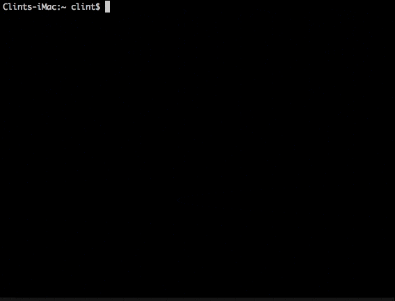

# Hence Client
This project provides a command-line interface to the hence.io framework, and is the recommended way to use it.

**NOTE:** This project is currently under heavy development, and is very likely to change. It is not recommended that anyone but hence.io developers use it at this point.

## Installation
This package should be installed globally.

`npm install -g hence-cli`

## Prerequisites
In order to use the `hence machine` commands, you'll need the following set up in your local OS (only tested on OSx so far, but most commands are expected to work in Windows/Linux as well)
* Vagrant 1.7.2+
* Virtualbox 4.3.0+

## Getting Help
You can view a list of available commands by typing:

`hence help`

To view help for any subcommand, type:

`hence [command] --help`

or

`hence [command] [subcommand] -h`

## Quick Start Guide
### 1. Initialize a new Machine (VM)
To initialize a new [Hence.io development environment](https://github.com/hence-io/hence), run the following from your terminal:

`hence machine init`

This should open up an interactive wizard as pictured below.

The wizard will first ask you whether or not you would like to use a custom setup, or go with the defaults.  If you choose to use a custom setup (which is the initially selected option), you will be shown the default setting at each config prompt, and be able to accept it with pressing 'enter', or provide your own.

The default VM settings are as follows:
* **Install Location**: $HOME/hence - This location must be present.  If it does not exist, the installer will attempt to create it.
* **Name**: hence
* **IP Address**: 172.19.8.100
* **Dashboard Port**: 8080
* **CPU's**: 2 (you should use the max number of CPU's available on your machine)
* **Memory**: 2048 (recommended is 4096 if your machine can handle it)

After setting up your config options, you will be prompted for final confirmation before the installation proceeds.  The default confirmation value is set to true, so pressing 'enter' at this point will begin the installation.

Upon completion of the **machine init** wizard, a vagrant/virtualbox vm with a rancher server and agent will be installed and configured for use. Here are the main components it will install:

_VM Host_
* Ubuntu 14.04 OS
* Docker 1.7.1 (with TCP forwarding to port 2375)

_Vagrant Plugins_
* [vagrant-vbguest](https://github.com/dotless-de/vagrant-vbguest)
* [vagrant-gatling-rsync](https://github.com/smerrill/vagrant-gatling-rsync)
* [vagrant-hostsupdater](https://github.com/cogitatio/vagrant-hostsupdater)

_Rancher_ (Docker container management infrastructure.  [Homepage](http://rancher.com/rancher/) | [Docs](http://docs.rancher.com/))
* Rancher Server instance
* Rancher Agent instance
* Rancher UI

### 2. Launch the Rancher dashboard
If your host OS allows it, the Rancher dashboard should open up by default after installation.  If it doesn't open, it should be available in your browser at [IP_ADDRESS | NAME]:[PORT], which will depend on the options you chose during installation.  For the default installation, it would be available at http://172.19.8.100:8080 (Linux, OSx, Windows), or http://hence:8080 (Linux, OSx).

You can open it yourself using the CLI with the following command:

`hence machine dashboard`

### 3. Connect with the Rancher API
In order to deploy your projects on Rancher, you'll need to connect it.

#### Hard Way :(
This can be done as a manual multi-step process, as documented by Rancher [here](http://docs.rancher.com/rancher/quick-start-guide/#create-a-multi-container-application-using-rancher-compose), which will involve manually creating API keys, downloading and installing the Rancher-Compose tool, and exporting the appropriate environment variables to your current terminal session.

#### Easy Way :)
Thankfully, this can also be accomplished through the Hence CLI with the following 2 commands:

> `hence machine connect -i`

This will accomplish 2 things:
1. It will make an initial connection to the Rancher API, and because there are no keys associated with your new machine, it will create them
2. The '-i' switch will cause it to install local dependancies, which are rancher-compose and docker@1.7.1

Now we need to export the connection variables to our local terminal session:

`eval $(hence machine connect -x)`

This will cause the needed environment variables to be exported to your current terminal session, and will look very familiar to anyone who's used docker-machine before.

### 4. Begin using your new machine!
Your machine is now ready for use.  Below are a couple of important pointers regarding how to use your own projects within the [Hence VM](https://github.com/hence-io/hence), as well as some further suggested reading for those who are unfamiliar with Docker and/or the Rancher framework.

#### Mounting your local files into the VM
Now that you have a fully-functional VM set up, you're going to want to mount your project code from your Host OS (i.e. Mac OSx, Windows) into your VM so that it will be available to the docker containers that will be running it.  There are 2 folders set up in your VM installation location for this:
1. projects: This is where you'll place (or symlink in) your project code.
2. mount: This directory is for mounting any miscellaneous files/folders that you want in the VM, but don't really belong in the project directory.

For projects, we use and recommend a similar file structure as depicted below, though it's entirely up to you how you want to organize your own:

    | machine root
    ├─ projects
    |  ├─ [project-1]
    |  |  ├─ public (put your project code in this folder)
    |  |  ├─ data
    |  |  |  ├─ mysql
    |  |  |  ├─ solr
    |  |  |  └─ etc
    |  |  └─ etc
    |  |
    |  └─ [project-2]
    |     └─ etc
    |
    └─ mount
       └─ [whatever-you-want]

NOTE: Due to performance reasons, we are using rsync to mount local files into the VM over NFS file shares.  This is a one-way sync, and thus, files created by your application will not automatically rsync'ed back down to your local filesystem.  Rsync

#### Further suggested reading
The Hence.io framework relies heavily on docker containers for all it's project management. If you are unfamiliar with docker, you should start by reading up on at least the following concepts from the Docker Documentation.
1. [About Docker](http://docs.docker.com/misc/)
2. [Docker Compose](http://docs.docker.com/compose/)

On top of Docker, the Hence.io framework uses rancher for docker container/service scheduling and discovery. Rancher, at it's most basic level, provides a UI for building 'Stacks', which are comprised of one or many docker containers that work together to deliver a fully-functioning application.  If you think of a LEMP stack, you might have the following containers working together:
* MariaDb (or MySql)
* PHP
* Nginx (or Apache)

Rancher uses docker-compose.yml files to 'tie' these containers together so that they can communicate with each other.  You will likely end up creating your own docker-compose.yml files for each stack that you use.

It's suggested that you have a good read over the [Rancher Quick Start Guide](http://docs.rancher.com/rancher/quick-start-guide/) for a good understanding of how to use rancher and rancher-compose (or `hence compose`, which is a convenience wrapper around it). Since the rancher server and agents have already been installed for you, you should begin reading at the 'Create a Container through UI' section ([link](http://docs.rancher.com/rancher/quick-start-guide/#create-a-container-through-ui)).

As well, and at the bare minimum, you should also read this quick overview of [rancher concepts](http://docs.rancher.com/rancher/concepts/) that will shed some light on what rancher is doing and is capable of.

## Command-Specific Documentation
Click the appropriate links below to read full documentation of the various Hence CLI commands available.

Command | Description
--- | ---
 [machine](./docs/machine.md)   |  Create and manage Hence.io Machines.  Currently limitied to local VM's, but remote Machine functionality is coming soon.  
 [compose](./docs/compose.md)   |  Run rancher-compose commands against any machine.  The `project` command will encompass what this does and more, but this is very useful if you'd like to experiment with on-off stacks without creating Hence Projects out of them.  
 [project](./docs/project.md)   |  **_(coming soon)_** Create and manage Hence.io Projects.  Allows easy definition of Hence Projects, and running them on any active Machines.  
