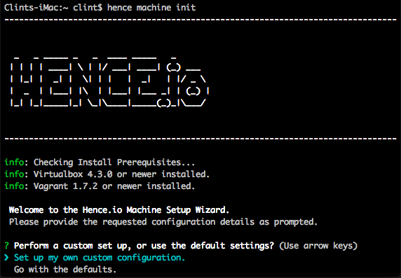

# Hence Client
This project aims to provide a client interface to the hence.io framework.

**NOTE:** This project is currently under heavy development, and is very likely to change. It is not recommended that anyone but hence.io developers use it at this point.

## Installation
This package should be installed globally.

`npm install -g hence-cli`

## Prerequisites
In order to use the `hence machine` commands, you'll need the following set up in your local OS (only tested on OSx so far, but most commands are expected to work in Windows/Linux as well)
* Vagrant 1.7.2+
* Virtualbox 4.3.0+

## Getting Help
You can view a list of available commands by typing:

`hence help`

To view help for any subcommand, type:

`hence [command] --help`

or

`hence [command] [subcommand] -h`

## Quick Start Guide
### Initialize a new Machine (VM)
To initialize a new hence.io development environment, run the following from your terminal:

`hence machine init`

This should open up an interactive wizard as pictured below.

The wizard will first ask you whether or not you would like to use a custom setup, or go with the defaults.  If you choose to use a custom setup (which is the initially selected option), you will be shown the default setting at each config prompt, and be able to accept it with pressing 'enter', or provide your own.

The default VM settings are as follows:
* **Install Location**: $HOME/hence - This location must be present.  If it does not exist, the installer will attempt to create it.
* **Name**: hence
* **IP Address**: 172.19.8.100
* **Dashboard** Port: 8080
* **CPU's**: 2 (you should use the max number of CPU's available on your machine)
* **Memory**: 2048 (recommended is 4096 if your machine can handle it)

After setting up your config options, you will be prompted for final confirmation before the installation proceeds.  The default confirmation value is set to true, so pressing 'enter' at this point will begin the installation.

Upon completion of the **machine init** wizard, a vagrant/virtualbox vm with a rancher server and agent will be installed and configured for use. Here are the main components it will install:

**VM Host**
* Ubuntu 14.04 OS
* Docker 1.7.1 (with TCP forwarding to port 2375)

**Vagrant Plugins**
* [vagrant-vbguest](https://github.com/dotless-de/vagrant-vbguest)
* [vagrant-gatling-rsync](https://github.com/smerrill/vagrant-gatling-rsync)
* [vagrant-hostsupdater](https://github.com/cogitatio/vagrant-hostsupdater)

**Rancher** (Docker container management infrastructure.  [Rancher Homepage](http://rancher.com/rancher/) | [Rancher Documenation](http://docs.rancher.com/))
* Rancher Server instance
* Rancher Agent instance
* Rancher UI

## Command-Specific Documentation
* [hence machine](docs/machine.md)
* [hence compose](docs/compose.md)
* [hence project](docs/project.md)
